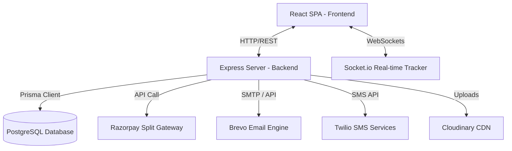

# Furzo (StrayCare) Technical Documentation

Welcome to the technical documentation for **Furzo** (formerly known as StrayCare). This document serves as a comprehensive developer reference, architecture manual, and setup guide for the codebase.

---

## 1. Project Overview

### Purpose & Objectives
Furzo is an all-in-one community and platform dedicated to street animal welfare. It simplifies animal rescue, streamlines adoptions, empowers crowdfunding campaigns for veterinary treatments, and connects vets, rescuers, NGOs, shelters, and citizens under a unified digital network.

### Core Features
- **Emergency Reporting & Live Tracking**: Users can report injured or stray animals with geolocation and photos. Rescuers are assigned and their live position is streamed via Socket.io.
- **Role-Based Portals**: Custom interfaces and dashboards for standard Users, Rescuers, Vets, Partners (NGOs/Shelters), and Admins.
- **Crowdfunding & Donations**: Split-payment enabled crowdfunding using Razorpay to finance animal care, with automatic commission/fee calculations.
- **Social Feed & Community**: A photo feed where volunteers and users can share updates, post pictures, like, and comment to build a strong community.
- **Pet Adoptions**: Partner shelters and clinics can list pets, process adoption questionnaires, and schedule interviews.
- **Medical Records**: Vets can create diagnosis and treatment reports directly linked to rescued animal reports.

### Target Users
- **General Citizens**: Report strays in distress, donate to campaigns, browse/adopt pets, and post updates on the feed.
- **Rescuers**: View assigned rescue locations, navigate to spots, and update real-time positions.
- **Vets / Clinics**: Manage clinic pets, document medical diagnoses, and coordinate treatment plans.
- **NGOs / Shelters (Partners)**: Host campaigns, receive donations directly, list animals for adoption, and verify volunteers.
- **System Administrators**: Audit applications, monitor transactions, moderate feed posts, and manage platform-wide statistics.

---

## 2. Technology Stack

| Layer | Technology | Usage / Purpose |
| :--- | :--- | :--- |
| **Frontend** | React (Vite) | Declarative single-page application framework. |
| | Zustand | Lightweight state management for Auth, Posts, and Rescue tracking. |
| | Vanilla CSS | Custom styled components, custom variables, and responsive grids. |
| | Axios | Client-side API requests with auth & refresh token interceptors. |
| **Backend** | Node.js + Express | RESTful API server handling business logic and request routing. |
| | Socket.io | WebSockets wrapper for real-time rescuer tracking coordinates. |
| | Prisma ORM | Type-safe database client and migrations management. |
| **Database** | PostgreSQL | Relational transactional database (hosted on neon.tech or similar). |
| **Services** | Razorpay | Payment gateway for donations and split-payout subscriptions. |
| | Brevo (Sendinblue) | Transactional email delivery API for registration/OTP notifications. |
| | Twilio | SMS delivery interface for phone-based OTP verification. |
| | Cloudinary | Cloud storage for user avatars, report media, and post attachments. |
| **Deployment** | Vercel (Frontend) | Hosting with Vercel Analytics and Speed Insights. |
| | Docker | Containerized runner configuration for localized reproducibility. |

---

## 3. Directory Structure

```text
StrayCare/
├── backend/                       # REST API & WebSocket Server
│   ├── db/                        # Database Connection Setup
│   │   └── prisma.js              # Prisma Client Instantiation
│   ├── features/                  # Modular Business Logic Features
│   │   ├── admin/                 # Administration statistics, approvals, and moderations
│   │   ├── adoptions/             # Pet management and adoption requests
│   │   ├── auth/                  # JWT auth, user/partner registrations, and OTP handlers
│   │   ├── chat/                  # Messaging rooms and chats (extendable)
│   │   ├── feed/                  # Public feed and content listing
│   │   ├── funding/               # Campaigns, Razorpay payments, split transfers, webhooks
│   │   ├── medical/               # Veterinary documents and treatment reports
│   │   ├── partners/              # Partner info and commission records
│   │   ├── posts/                 # Social media posts, comments, and likes
│   │   ├── reports/               # Distress reports, rescues, and status logs
│   │   └── users/                 # Profile management and role upgrades
│   ├── prisma/                    # Schema Definitions & Migrations
│   │   └── schema.prisma          # Database models, relationships, and PostgreSQL settings
│   ├── services/                  # External service integrations
│   │   ├── email.service.js       # Brevo email API wrapper
│   │   └── sms.service.js         # Twilio SMS API wrapper
│   ├── utils/                     # Generic Helpers
│   │   ├── cloudinary.js          # Cloudinary file uploading configuration
│   │   └── otp.js                 # Random 6-digit code generator
│   ├── index.js                   # Application server, Socket.io entrypoint, daily cleanups
│   └── Dockerfile                 # Backend container configuration
├── frontend/                      # Single Page React Client
│   ├── src/                       # Frontend Source Root
│   │   ├── assets/                # Static assets, images, and system loaders
│   │   ├── components/            # Reusable UI Components (Navbar, Modals, Loaders)
│   │   ├── data/                  # Static constants, options, configurations
│   │   ├── pages/                 # Route-specific view components
│   │   │   ├── admin/             # Admin dashboards and management panels
│   │   │   ├── user/              # User-facing Home, Adopt, Emergency, Guide, Help, Tracking
│   │   │   ├── vet/               # Veterinary portal pages
│   │   │   ├── Privacy.jsx        # Privacy policy agreement
│   │   │   ├── Terms.jsx          # User terms of service
│   │   │   └── FAQ.jsx            # Frequently asked questions
│   │   ├── services/              # API Client Logic
│   │   │   └── api.js             # Axios client, interceptors, and exportable fetch functions
│   │   ├── store/                 # Zustand Global State
│   │   │   ├── authStore.js       # Auth token persistence and state update
│   │   │   ├── postStore.js       # Social feed data management
│   │   │   └── rescueStore.js     # Rescue actions state mapping
│   │   ├── styles/                # CSS Style Sheets
│   │   ├── App.jsx                # Client Routes configuration and asset preloader
│   │   ├── main.jsx               # React DOM hydration root
│   │   └── AdminApp.jsx / VetApp.jsx # Portal wrapper mounts
│   └── vite.config.js             # Vite environment build properties
├── docker-compose.yml             # Orchestrated build descriptor for local running
└── README.md                      # General introduction and layout description
```

---

## 4. System Architecture

### High-Level Architecture Diagram


### Key Architectural Flows

#### 1. Authentication & Session Flow
1. User logs in with email and password.
2. Express server validates credentials and responds with an Access Token (short-lived JWT) and a Refresh Token (stored in the database).
3. The React Client stores these tokens in `localStorage` inside `authStore`.
4. All subsequent API calls automatically inject `Authorization: Bearer <Access Token>` via Axios request interceptors.
5. If the request returns a `401 Unauthorized` status, the Axios response interceptor intercepts the failure, posts the Refresh Token to `/api/auth/refresh`, updates the client state, and retries the original API request.

#### 2. Distress Reporting & Rescuer Tracking
1. A citizen clicks **SOS / Rescue**, uploads an image, and allows browser geolocation.
2. The server creates an `AnimalReport` with status `REPORTED`.
3. An Admin or assigned Partner assigns a nearby `RESCUER` user. The report status transitions to `ASSIGNED`.
4. The Rescuer opens the navigation view. This establishes a WebSockets room connection on room `track-${reportId}`.
5. As the Rescuer moves, coordinates are continuously broadcast via `update-location` socket messages.
6. The Citizen's client listens to `location-updated` events inside the room, refreshing the map with the rescuer's position in real-time.

---

## 5. Frontend Documentation

### Route Mapping (App.jsx)
- **`/`**: Home (Landing details, statistics, emergency prompts).
- **`/adopt`**: Adopt (Browse pets filtering by category, breed, size).
- **`/emergency`**: Emergency (Map-based reporting dashboard for reporting strays).
- **`/track`**: Track (Report statuses and historical logs).
- **`/live-track/:reportId`**: Live Tracking (Socket-connected real-time map displaying Rescuer arrival).
- **`/post`**: Post (Feed uploads and community interaction).
- **`/help`**: Help (Crowdfunding lists and subscriptions panels).
- **`/profile`**: Profile (User statistics, documents, application history).
- **`/admin/*`**: Lazy-loaded Admin portal paths.
- **`/vet/*`**: Lazy-loaded Vet portal paths.

### State Management (Zustand)
- **`authStore`**: Manages auth states, login status, user roles, tokens, and verification checkpoints. Saves state directly to `straycare_user` key in `localStorage`.
- **`postStore`**: Handles timeline posts, pagination states, comment actions, and likes caching.
- **`rescueStore`**: Synchronizes current location coords, active navigation routes, and reports list.

---

## 6. Backend Documentation

### Route Registrations (index.js)
```javascript
app.use('/api/chat', chatRoutes);
app.use('/api/auth', authRoutes);
app.use('/api/reports', reportRoutes);
app.use('/api/adoptions', adoptionRoutes);
app.use('/api/feed', feedRoutes);
app.use('/api/posts', postRoutes);
app.use('/api/funding', fundingRoutes);
app.use('/api/users', userRoutes);
app.use('/api/medical', medicalRoutes);
app.use('/api/admin', adminRoutes);
app.use('/api/partners', partnerRoutes);
```

### Core Services
- **`email.service.js`**: Uses the `@getbrevo/brevo` client to send dynamic HTML verification codes and campaign donation summaries.
- **`sms.service.js`**: Integrates `twilio` for sending verification codes to phone numbers.

### Middleware & Security
- **Auth Middleware (`auth.middleware.js`)**: Decrypts the authorization headers, verifies the JWT signature against `JWT_SECRET`, checks expiration, and mounts the active user object onto `req.user`.
- **Rate Limiting**: Used platform-wide via `express-rate-limit` to prevent denial-of-service and route enumeration on authentication controllers.
- **Daily Cleanup Job**: A daily routine running at startup and every 24 hours automatically sweeps rejected user applications older than 3 days, executing cascade deletions across linked entities (Post, Comment, Volunteer, Report, and Partner records) to keep database sizes healthy.

---

## 7. Database Documentation (schema.prisma)

### Major Models & Attributes

#### `User`
- Central identity table.
- Holds `email`, `password`, `phone`, `role` (enum: `USER`, `RESCUER`, `VET`, `ADMIN`, `NGO`), and OTP parameters.
- Has relations to reports, adoptions, likes, and subscriptions.

#### `Partner`
- Relates directly to NGOs, shelters, and clinics.
- Contains verification status (enum: `PENDING`, `VERIFIED`, `SUSPENDED`, `REJECTED`).
- Stores banking and payout keys: `razorpayAccountId`, `upiId`, and `commissionEligible` status.

#### `AnimalReport`
- Represents a reported stray case.
- Fields: `locationLat`, `locationLng`, `description`, `mediaUrls`, and status (enum: `REPORTED`, `ASSIGNED`, `RESCUED`, `TREATED`, `ADOPTED`).
- Foreign keys: `reporterId`, `assignedRescuerId`, `assignedVetId`, `assignedPartnerId`.

#### `Campaign`
- Crowdfunding campaigns.
- Attributes: `goalAmount`, `raisedAmount`, `category` (`TREATMENT`, `FOOD`, `SHELTER`, `RESCUE`), `deadline`.
- Payout parameters: Linked to `partnerId`.

#### `Donation`
- Captures individual transaction success.
- Includes `grossAmount`, `netAmount`, `platformFee`, and payment transaction IDs (`razorpayPaymentLinkId`, `razorpayPaymentId`).

---

## 8. Authentication & Security

1. **Password Hashing**: Done using `bcryptjs` before committing user structures.
2. **Tokens Scheme**:
   - Access Token: Extracted using Bearer prefix, signed with 15-minute expiry.
   - Refresh Token: Persisted on database `User.refreshToken` and updated upon credentials verification or periodic re-authentication.
3. **Environment Isolation**: Database strings and external API keys are kept out of revision logs. Production deployments block generic CORS headers.

---

## 9. Feature-by-Feature Breakdown

### Crowdfunding & Campaigns
- **Purpose**: Facilitate fundraising for medical emergencies, food, and shelter operations.
- **User Flow**:
  1. A Partner (NGO/Clinic) creates a campaign.
  2. Users view the campaign list in `/help` and click "Donate".
  3. The server calls Razorpay API to generate a unique payment link.
  4. Upon transaction success, Razorpay hits our server's Webhook endpoint (`/api/funding/webhook`).
  5. The server calculates commission split if eligible, processes platform fees, marks the donation as `WEBHOOK_VERIFIED`, and updates the campaign's `raisedAmount`.

---

## 10. Configuration Documentation

### Environment Variables (.env)

#### Backend Configuration
```ini
PORT=5000
DATABASE_URL="postgresql://<username>:<password>@<host>:<port>/<dbname>?sslmode=require"
JWT_SECRET="supersecret_jwt_sign_key"
FRONTEND_URL="http://localhost:5173"

# Cloudinary Setup
CLOUDINARY_CLOUD_NAME=your_cloud_name
CLOUDINARY_API_KEY=your_api_key
CLOUDINARY_API_SECRET=your_api_secret

# Brevo (Email Service)
BREVO_API_KEY=xkeysib-xxxxxxxxx

# Twilio (SMS Setup)
TWILIO_ACCOUNT_SID=ACxxxxxxxxxxxx
TWILIO_AUTH_TOKEN=xxxxxxxxxxxxxxxx
TWILIO_PHONE_NUMBER=+1xxxxxxxxxx

# Razorpay Keys
RAZORPAY_KEY_ID=rzp_test_xxxxxxxx
RAZORPAY_KEY_SECRET=xxxxxxxxxxxxxx
RAZORPAY_WEBHOOK_SECRET=xxxxxxxxxxxxx
```

#### Frontend Configuration
```ini
VITE_API_BASE_URL="http://localhost:5000/api"
```

---

## 11. Performance & Optimization

- **Database Indexes**: Configured on high-frequency query fields in `schema.prisma` (`partnerType`, `verificationStatus`, `city`, `userId`, `campaignId`, `status`, `deadline`).
- **Asset Preloading**: Crucial portal and loader graphics are programmatically preloaded asynchronously during initial app startup inside `App.jsx` to prevent layout shift.
- **Client Splitting**: Large user views and admin/vet apps are loaded using React `lazy` and `Suspense` loaders to keep initial load bundles small.

---

## 12. Dependencies Analysis

### Core Node.js Modules
- `express` & `cors`: Web service baseline routing.
- `prisma` & `@prisma/client`: Type-safe queries instead of string concatenation.
- `socket.io`: Low-latency, full-duplex communication for coordinates update.
- `bcryptjs`: Dependency-free Javascript password hashing.
- `jsonwebtoken`: Signing authorization payload packages.
- `multer`: Multi-part parsing for file uploads.

### Critical React Modules
- `axios`: Request pipeline helper.
- `zustand`: High-performance context alternative for state management.
- `react-router-dom`: Native routing logic.

---

## 13. Code Quality Assessment

### Strengths
- **Modular Directory Layout**: Features are clean, self-contained directories linking routing, controllers, and schemas.
- **Database Resilience**: Strong schema referential integrity enforced at database layer through Prisma relations.
- **Fail-safe Session Hydration**: Silent access token refreshing keeps users from getting kicked out mid-session.

### Recommended Enhancements
- **Unit Testing**: Introduce Jest or Vitest suites to coverage-test crucial controllers (e.g. payout logic and auth checks).
- **TypeScript Integration**: Migrate backend Express layers to TypeScript to validate request shapes before execution.

---

## 14. API Documentation (Key Endpoints)

| Method | Endpoint | Description | Auth Required | Request Shape |
| :--- | :--- | :--- | :--- | :--- |
| `POST` | `/api/auth/register` | Register a new user | No | `{ name, email, password, phone }` |
| `POST` | `/api/auth/login` | Login user & fetch tokens | No | `{ email, password }` |
| `GET` | `/api/reports` | Get animal distress reports | Yes | None |
| `POST` | `/api/reports` | Report a new animal case | Yes (Multpart) | `{ description, lat, lng, image }` |
| `POST` | `/api/funding/donate` | Create a donation intent | Yes | `{ campaignId, amount }` |
| `POST` | `/api/funding/webhook` | Razorpay event receiver | No | Razorpay webhook payload |

---

## 15. Deployment & Local Setup Guide

### Prerequisites
- Node.js (v18+)
- PostgreSQL instance running locally or hosted online.
- Docker & Docker Compose (Optional)


